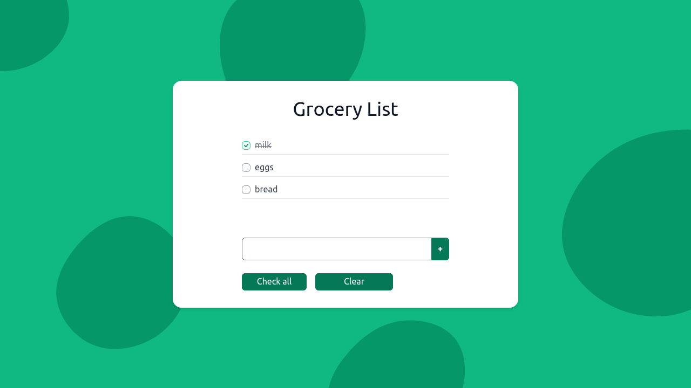

# Grocery List

A lightweight, intuitive grocery list web app.

  
Table of Contents

  <ol>
    <li><a href="#description">Description</a></li>
    <li><a href="#live-demo">Live App</a></li>
    <li><a href="#built-with">Built With</a></li>
    <li><a href="#author">Author</a></li>
    <li><a href="#license">License</a></li>
  </ol>

## Description

This grocery list app allows users to add grocery items to a list, toggle whether the items are checked off the list, and remove checked items.

The app is a progressive web app, so it fully supports being installed on users devices and being used without an internet connection.

 

## Live App

Preview the live app: [https://jonrutter-grocery.netlify.app/](https://jonrutter-grocery.netlify.app/)

## Built with

- [TypeScript](https://www.typescriptlang.org/)
- [React](https://reactjs.org/)
- [Tailwind CSS](https://tailwindcss.com/)

## Author

**Jon Rutter**

- [GitHub Profile](https://www.github.com/jonrutter)
- [Email](mailto:contact@jonrutter.io)
- [Website](https://www.jonrutter.io)

## License

This project is licensed under the MIT License. See the LICENSE file for details.

